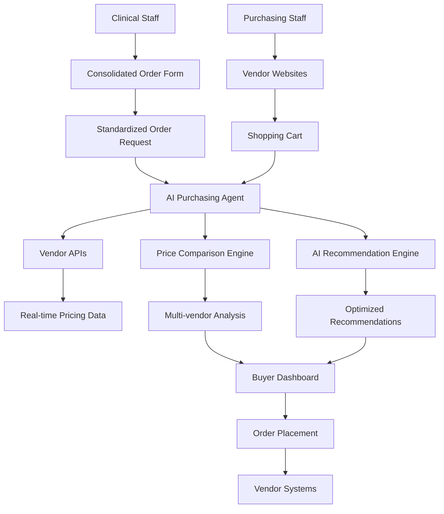

# AI Purchasing Agent for Medical Practice Procurement
## Monorepo Development PRD

**Document Version**: 1.0  
**Created**: January 2025  
**Author**: Ganger Platform Development Team  
**Status**: Draft  
**Platform Integration**: Ganger Platform Monorepo v1.6.0

---

## 1. Executive Summary

### 1.1 Product Vision
Develop an AI-powered purchasing agent that integrates seamlessly with the Ganger Platform monorepo architecture, following all established patterns and shared package dependencies. The solution will intercept medical supply procurement requests, perform real-time multi-vendor price comparison, and recommend optimal purchasing decisions to reduce costs and improve procurement efficiency for Ganger Dermatology.

### 1.2 Monorepo Integration Strategy
This application will be built as **two separate applications** within the Ganger Platform monorepo:

1. **AI Purchasing Agent** (`apps/ai-purchasing-agent`) - Staff-facing administrative interface
2. **Consolidated Order Form** (`apps/consolidated-order-form`) - Simplified ordering interface for clinical staff

Both applications will leverage the full Ganger Platform shared infrastructure while maintaining the established distributed deployment architecture.

### 1.3 Success Metrics
- **Primary**: 8-15% reduction in medical supply costs ($10,800-20,250/year)
- **Secondary**: 50% reduction in procurement decision time
- **Tertiary**: 90% contract compliance rate for GPO pricing
- **Monorepo Integration**: 100% shared package compliance, zero custom implementations

---

## 2. Monorepo Architecture Integration

### 2.1 Application Structure

#### **App 1: AI Purchasing Agent** (`apps/ai-purchasing-agent`)
```
apps/ai-purchasing-agent/
├── src/
│   ├── app/                    # Next.js App Router
│   │   ├── layout.tsx          # AuthProvider + StaffPortalLayout
│   │   ├── page.tsx            # Main dashboard
│   │   ├── vendor-comparison/  # Price comparison interface
│   │   ├── recommendations/    # AI recommendations review
│   │   ├── api/               # API routes for vendor integration
│   │   └── settings/          # Configuration and rules
│   ├── components/            # App-specific components
│   │   ├── VendorPriceGrid.tsx
│   │   ├── RecommendationCard.tsx
│   │   ├── ContractComplianceWidget.tsx
│   │   └── OrderOptimization.tsx
│   ├── lib/                   # App utilities
│   │   ├── ai-engine.ts       # AI recommendation logic
│   │   ├── vendor-apis.ts     # Vendor integration utilities
│   │   └── price-analysis.ts  # Price comparison logic
│   └── hooks/                 # App-specific hooks
│       ├── useVendorPricing.ts
│       ├── useAIRecommendations.ts
│       └── usePriceComparison.ts
├── next.config.js             # Standard Ganger Platform config
├── package.json               # Shared packages + OpenAI/vendor APIs
├── tsconfig.json              # Extends @ganger/config
├── postcss.config.js          # @tailwindcss/postcss
├── tailwind.config.js         # Extends @ganger/config
└── vercel.json               # Monorepo-aware build config
```

#### **App 2: Consolidated Order Form** (`apps/consolidated-order-form`)
```
apps/consolidated-order-form/
├── src/
│   ├── app/
│   │   ├── layout.tsx          # Simplified layout for clinical staff
│   │   ├── page.tsx            # Main order form
│   │   ├── api/               # Order submission and processing
│   │   └── success/           # Order confirmation
│   ├── components/
│   │   ├── ProductCatalog.tsx  # Standardized product list
│   │   ├── OrderBuilder.tsx    # Drag & drop order creation
│   │   ├── QuantitySelector.tsx # Case vs box selection
│   │   └── DepartmentSelector.tsx
│   ├── lib/
│   │   ├── catalog-data.ts     # Product standardization logic
│   │   ├── usage-patterns.ts   # Historical usage analysis
│   │   └── order-validation.ts # Order rules and constraints
│   └── hooks/
│       ├── useProductCatalog.ts
│       ├── useOrderDraft.ts
│       └── useUsageHistory.ts
├── next.config.js
├── package.json               # Shared packages only
├── tsconfig.json
├── postcss.config.js
├── tailwind.config.js
└── vercel.json
```

### 2.2 Shared Package Dependencies

#### **Required Shared Packages**
```json
{
  "dependencies": {
    "next": "^14.2.29",
    "react": "^18.3.1",
    "react-dom": "^18.3.1",
    "@ganger/deps": "workspace:*",
    "@ganger/auth": "workspace:*",
    "@ganger/cache": "workspace:*",
    "@ganger/config": "workspace:*",
    "@ganger/db": "workspace:*",
    "@ganger/integrations": "workspace:*",
    "@ganger/monitoring": "workspace:*",
    "@ganger/types": "workspace:*",
    "@ganger/ui": "workspace:*",
    "@ganger/utils": "workspace:*"
  }
}
```

#### **App-Specific Dependencies**
```json
{
  "ai-purchasing-agent": {
    "dependencies": {
      "openai": "^4.28.0",
      "pdf-parse": "^1.1.1",
      "csv-parse": "^5.3.4"
    }
  },
  "consolidated-order-form": {
    "dependencies": {
      // No additional dependencies - uses shared packages only
    }
  }
}
```

### 2.3 TypeScript Configuration

#### **Standard Monorepo TypeScript Setup**
```json
// apps/ai-purchasing-agent/tsconfig.json
{
  "extends": "../../packages/config/typescript/nextjs.json",
  "compilerOptions": {
    "baseUrl": ".",
    "paths": {
      "@/*": ["./src/*"],
      "@ganger/*": ["../../packages/*/src"]
    }
  },
  "include": [
    "next-env.d.ts",
    "**/*.ts",
    "**/*.tsx",
    ".next/types/**/*.ts"
  ]
}
```

### 2.4 Deployment Configuration

#### **Vercel Configuration (Standard Pattern)**
```json
// apps/ai-purchasing-agent/vercel.json
{
  "installCommand": "cd ../.. && NODE_ENV=development pnpm install --no-frozen-lockfile",
  "buildCommand": "cd ../.. && pnpm -F @ganger/ai-purchasing-agent build",
  "outputDirectory": ".next",
  "framework": "nextjs",
  "env": {
    "NODE_ENV": "development"
  }
}
```

#### **Package.json Scripts (Standard Pattern)**
```json
{
  "name": "@ganger/ai-purchasing-agent",
  "scripts": {
    "dev": "next dev",
    "build": "next build",
    "start": "next start",
    "lint": "next lint",
    "type-check": "tsc --noEmit"
  }
}
```

---

## 3. Shared Infrastructure Integration

### 3.1 Authentication Integration

#### **Staff Portal Authentication**
```typescript
// apps/ai-purchasing-agent/src/app/layout.tsx
import { AuthProvider } from '@ganger/auth';
import { StaffPortalLayout } from '@ganger/ui/staff';

export default function RootLayout({
  children
}: {
  children: React.ReactNode;
}) {
  return (
    <html lang="en">
      <body>
        <AuthProvider appName="ai-purchasing-agent">
          <StaffPortalLayout currentApp="ai-purchasing-agent">
            {children}
          </StaffPortalLayout>
        </AuthProvider>
      </body>
    </html>
  );
}
```

#### **Consolidated Order Form - Simplified Auth**
```typescript
// apps/consolidated-order-form/src/app/layout.tsx
import { AuthProvider } from '@ganger/auth';
import { SimpleLayout } from '@ganger/ui/layouts';

export default function RootLayout({
  children
}: {
  children: React.ReactNode;
}) {
  return (
    <html lang="en">
      <body>
        <AuthProvider appName="consolidated-order-form">
          <SimpleLayout>
            {children}
          </SimpleLayout>
        </AuthProvider>
      </body>
    </html>
  );
}
```

### 3.2 Database Integration

#### **Database Schema Extensions**
```sql
-- Add to existing Supabase migrations
-- Location: supabase/migrations/YYYYMMDD_purchasing_agent.sql

-- Standardized Product Catalog
CREATE TABLE standardized_products (
  id UUID PRIMARY KEY DEFAULT gen_random_uuid(),
  created_at TIMESTAMPTZ DEFAULT NOW(),
  updated_at TIMESTAMPTZ DEFAULT NOW(),
  
  name TEXT NOT NULL,
  category product_category NOT NULL,
  description TEXT,
  specifications JSONB,
  standard_package_size TEXT NOT NULL,
  minimum_order_quantity INTEGER DEFAULT 1,
  maximum_order_quantity INTEGER,
  average_monthly_usage DECIMAL,
  
  vendor_mappings JSONB NOT NULL DEFAULT '[]'::jsonb,
  substitute_products UUID[],
  
  is_active BOOLEAN DEFAULT true,
  image_url TEXT
);

-- Consolidated Orders
CREATE TABLE consolidated_orders (
  id UUID PRIMARY KEY DEFAULT gen_random_uuid(),
  created_at TIMESTAMPTZ DEFAULT NOW(),
  updated_at TIMESTAMPTZ DEFAULT NOW(),
  
  requester_id UUID REFERENCES users(id) NOT NULL,
  department TEXT,
  items JSONB NOT NULL,
  status order_status DEFAULT 'draft',
  
  submitted_at TIMESTAMPTZ,
  optimized_recommendation JSONB,
  notes TEXT,
  urgency urgency_level DEFAULT 'routine'
);

-- AI Purchase Recommendations
CREATE TABLE purchase_recommendations (
  id UUID PRIMARY KEY DEFAULT gen_random_uuid(),
  created_at TIMESTAMPTZ DEFAULT NOW(),
  
  consolidated_order_id UUID REFERENCES consolidated_orders(id),
  vendor_quotes JSONB NOT NULL,
  ai_analysis JSONB NOT NULL,
  recommended_vendor_split JSONB NOT NULL,
  
  estimated_savings DECIMAL,
  confidence_score DECIMAL,
  
  approved_at TIMESTAMPTZ,
  approved_by UUID REFERENCES users(id)
);

-- Enable RLS
ALTER TABLE standardized_products ENABLE ROW LEVEL SECURITY;
ALTER TABLE consolidated_orders ENABLE ROW LEVEL SECURITY;
ALTER TABLE purchase_recommendations ENABLE ROW LEVEL SECURITY;
```

#### **Database Operations Using @ganger/db**
```typescript
// apps/ai-purchasing-agent/src/lib/database-operations.ts
import { db, Repository } from '@ganger/db';
import type { StandardizedProduct, ConsolidatedOrder } from '@ganger/types';

export class PurchasingRepository {
  private products = new Repository<StandardizedProduct>('standardized_products');
  private orders = new Repository<ConsolidatedOrder>('consolidated_orders');

  async getStandardizedCatalog() {
    return this.products.findMany({
      where: { is_active: true },
      orderBy: { category: 'asc', name: 'asc' }
    });
  }

  async createConsolidatedOrder(data: Partial<ConsolidatedOrder>) {
    return this.orders.create(data);
  }

  async getOrderHistory(userId: string, limit = 50) {
    return this.orders.findMany({
      where: { requester_id: userId },
      orderBy: { created_at: 'desc' },
      limit
    });
  }
}
```

### 3.3 UI Component Integration

#### **Mandatory @ganger/ui Usage**
```typescript
// apps/ai-purchasing-agent/src/components/VendorPriceGrid.tsx
import { 
  DataTable, 
  Button, 
  Card, 
  Badge,
  LoadingSpinner 
} from '@ganger/ui';
import { formatCurrency, formatDate } from '@ganger/utils/formatting';

interface VendorPriceGridProps {
  vendorQuotes: VendorQuote[];
  onSelectVendor: (vendorId: string) => void;
}

export function VendorPriceGrid({ vendorQuotes, onSelectVendor }: VendorPriceGridProps) {
  const columns = [
    {
      key: 'vendor',
      header: 'Vendor',
      render: (quote: VendorQuote) => (
        <div className="flex items-center gap-2">
          <Badge variant={quote.contractPricing ? 'success' : 'default'}>
            {quote.vendorName}
          </Badge>
          {quote.contractPricing && <span className="text-xs text-green-600">Contract</span>}
        </div>
      )
    },
    {
      key: 'price',
      header: 'Unit Price',
      render: (quote: VendorQuote) => formatCurrency(quote.unitPrice)
    },
    {
      key: 'total',
      header: 'Total',
      render: (quote: VendorQuote) => formatCurrency(quote.totalPrice)
    },
    {
      key: 'delivery',
      header: 'Delivery',
      render: (quote: VendorQuote) => formatDate(quote.estimatedDelivery)
    },
    {
      key: 'actions',
      header: 'Actions',
      render: (quote: VendorQuote) => (
        <Button 
          variant="primary" 
          size="sm"
          onClick={() => onSelectVendor(quote.vendorName)}
        >
          Select
        </Button>
      )
    }
  ];

  return (
    <Card>
      <DataTable 
        data={vendorQuotes}
        columns={columns}
        searchable
        sortable
      />
    </Card>
  );
}
```

#### **Consolidated Order Form Components**
```typescript
// apps/consolidated-order-form/src/components/ProductCatalog.tsx
import { Input, Button, Card, Badge } from '@ganger/ui';
import { useProductCatalog } from '../hooks/useProductCatalog';

export function ProductCatalog() {
  const { products, searchTerm, setSearchTerm, selectedCategory, setSelectedCategory } = useProductCatalog();

  return (
    <div className="space-y-4">
      <div className="flex gap-4">
        <Input
          placeholder="Search products..."
          value={searchTerm}
          onChange={(e) => setSearchTerm(e.target.value)}
          className="flex-1"
        />
        {/* Category filters using @ganger/ui components */}
      </div>
      
      <div className="grid grid-cols-1 md:grid-cols-2 lg:grid-cols-3 gap-4">
        {products.map((product) => (
          <Card key={product.id} className="p-4">
            <div className="flex items-start justify-between">
              <div>
                <h3 className="font-medium">{product.name}</h3>
                <p className="text-sm text-gray-600">{product.description}</p>
                <Badge variant="outline">{product.category}</Badge>
              </div>
              <Button size="sm" variant="outline">
                Add
              </Button>
            </div>
          </Card>
        ))}
      </div>
    </div>
  );
}
```

### 3.4 External Integration via @ganger/integrations

#### **AI Services Integration**
```typescript
// apps/ai-purchasing-agent/src/lib/ai-engine.ts
import { UniversalAIHub } from '@ganger/integrations/ai';
import type { PurchaseRequest, VendorQuote } from '@ganger/types';

export class AIRecommendationEngine {
  private aiHub = new UniversalAIHub();

  async analyzeVendorQuotes(
    request: PurchaseRequest, 
    quotes: VendorQuote[]
  ): Promise<AIRecommendation> {
    const prompt = this.buildAnalysisPrompt(request, quotes);
    
    const analysis = await this.aiHub.analyze({
      model: 'gpt-4',
      prompt,
      context: {
        historical_purchases: await this.getHistoricalData(request.items),
        contract_terms: await this.getContractTerms(),
        inventory_levels: await this.getCurrentInventory()
      }
    });

    return {
      recommendedVendor: analysis.recommended_vendor,
      savings: analysis.estimated_savings,
      reasoning: analysis.reasoning,
      confidence: analysis.confidence_score,
      alternativeOptions: analysis.alternatives
    };
  }

  private buildAnalysisPrompt(request: PurchaseRequest, quotes: VendorQuote[]): string {
    return `
      Analyze this medical supply purchase request and vendor quotes.
      
      Request Details:
      ${JSON.stringify(request, null, 2)}
      
      Vendor Quotes:
      ${JSON.stringify(quotes, null, 2)}
      
      Consider:
      1. Total cost including shipping
      2. Contract compliance and GPO pricing
      3. Delivery timeframes for urgent items
      4. Vendor reliability and quality
      5. Volume discount opportunities
      6. Standardization benefits
      
      Provide recommendation with detailed reasoning.
    `;
  }
}
```

#### **Vendor API Integration**
```typescript
// apps/ai-purchasing-agent/src/lib/vendor-apis.ts
import { UniversalAPIHub } from '@ganger/integrations/external';
import { logger } from '@ganger/monitoring';

export class VendorIntegrationService {
  private apiHub = new UniversalAPIHub();

  async getHenryScheinPricing(items: LineItem[]): Promise<VendorQuote[]> {
    try {
      const quotes = await this.apiHub.request({
        vendor: 'henry-schein',
        endpoint: '/pricing/bulk-quote',
        method: 'POST',
        data: { items },
        auth: {
          type: 'api-key',
          key: process.env.HENRY_SCHEIN_API_KEY
        }
      });

      return quotes.map(this.transformHenryScheinQuote);
    } catch (error) {
      logger.error('Henry Schein API error', { error, items });
      throw new Error('Failed to fetch Henry Schein pricing');
    }
  }

  async getAmazonBusinessPricing(items: LineItem[]): Promise<VendorQuote[]> {
    // Implementation using Amazon Business API
    // Following same pattern as Henry Schein
  }

  private transformHenryScheinQuote(rawQuote: any): VendorQuote {
    return {
      vendorName: 'Henry Schein',
      productMatch: {
        confidence: rawQuote.match_confidence,
        sku: rawQuote.sku,
        name: rawQuote.product_name
      },
      unitPrice: rawQuote.unit_price,
      totalPrice: rawQuote.total_price,
      shipping: rawQuote.shipping_cost,
      estimatedDelivery: new Date(rawQuote.delivery_date),
      contractPricing: rawQuote.contract_applied,
      inStock: rawQuote.availability === 'in_stock'
    };
  }
}
```

---

## 4. Implementation Plan - Monorepo Development

### 4.1 Development Phases

#### **Phase 1: Foundation & Shared Infrastructure (Weeks 1-3)**
**Monorepo Setup:**
```bash
# Create app directories following monorepo patterns
mkdir -p apps/ai-purchasing-agent
mkdir -p apps/consolidated-order-form

# Initialize apps with standard configuration
cd apps/ai-purchasing-agent
pnpm create next-app@latest . --typescript --tailwind --app
cd ../consolidated-order-form  
pnpm create next-app@latest . --typescript --tailwind --app

# Configure shared packages
# Update each package.json with @ganger/* dependencies
# Configure TypeScript, ESLint, Tailwind using @ganger/config
```

**Database Schema:**
```bash
# Create migration
cd supabase
supabase migration new purchasing_agent_schema

# Add tables for standardized products, orders, recommendations
# Follow established RLS patterns from other apps
```

**Deliverables:**
- Both apps initialize with shared package dependencies
- Database schema extends existing Supabase setup
- TypeScript compilation passes with 0 errors
- Basic UI using @ganger/ui components only

#### **Phase 2: Standardized Product Catalog (Weeks 4-6)**
**Data Analysis & Catalog Creation:**
```typescript
// Create migration script to analyze existing purchase data
// apps/ai-purchasing-agent/src/scripts/analyze-purchase-history.ts
import { PurchasingRepository } from '../lib/database-operations';
import { analyzeAmazonOrders, analyzeHenryScheinOrders } from '../lib/data-analysis';

async function createStandardizedCatalog() {
  // Analyze Amazon order history
  const amazonData = await analyzeAmazonOrders();
  
  // Analyze Henry Schein purchase history
  const henryScheinData = await analyzeHenryScheinOrders();
  
  // Create standardized product entries
  const standardizedProducts = consolidateProducts(amazonData, henryScheinData);
  
  // Insert into database using @ganger/db
  const repo = new PurchasingRepository();
  await repo.bulkCreateProducts(standardizedProducts);
}
```

**Consolidated Order Form Implementation:**
```typescript
// apps/consolidated-order-form/src/components/ProductCatalog.tsx
// Using established patterns from other Ganger apps
// Mandatory use of @ganger/ui components
// Mobile-optimized for tablet usage in clinical areas
```

**Deliverables:**
- Standardized product catalog based on historical data
- Working consolidated order form interface
- Mobile-responsive design using @ganger/ui
- Integration with @ganger/auth for staff authentication

#### **Phase 3: AI Recommendation Engine (Weeks 7-10)**
**AI Integration Following Monorepo Patterns:**
```typescript
// Use @ganger/integrations for external AI services
// No direct OpenAI imports - go through Universal Hub
// Follow established error handling from @ganger/monitoring
// Cache recommendations using @ganger/cache
```

**Vendor API Integration:**
```typescript
// Follow patterns from @ganger/integrations/external
// Use Universal Hub pattern for all vendor APIs
// Implement proper error handling and fallbacks
// Add monitoring and alerting
```

**Price Comparison Engine:**
```typescript
// Build on @ganger/utils for data processing
// Use @ganger/ui components for comparison tables
// Implement real-time updates via Supabase subscriptions
```

**Deliverables:**
- AI recommendation engine using shared infrastructure
- Multi-vendor price comparison working
- Real-time price updates via Supabase
- Error handling and monitoring integration

#### **Phase 4: Integration & Deployment (Weeks 11-12)**
**Vercel Deployment Setup:**
```bash
# Create Vercel projects following distributed architecture
vercel --prod apps/ai-purchasing-agent
vercel --prod apps/consolidated-order-form

# Configure environment variables in Vercel dashboard
# Add apps to staff portal navigation
# Test distributed deployment architecture
```

**Staff Portal Integration:**
```typescript
// Update packages/ui/src/staff/StaffPortalLayout.tsx
const STAFF_APPS = [
  // ... existing apps
  {
    name: 'AI Purchasing Agent',
    path: '/ai-purchasing-agent',
    icon: ShoppingCartIcon,
    category: 'Business',
    description: 'Intelligent procurement with multi-vendor price comparison',
    roles: ['manager', 'billing', 'superadmin']
  },
  {
    name: 'Order Supplies',
    path: '/consolidated-order-form',
    icon: ClipboardListIcon,
    category: 'Medical',
    description: 'Quick order form for medical supplies',
    roles: ['staff', 'nurse', 'medical_assistant', 'provider']
  }
];
```

**Quality Gates:**
```bash
# All quality gates must pass before deployment
pnpm type-check                    # 0 TypeScript errors
pnpm audit:package-boundaries      # 100% shared package compliance
pnpm audit:ui-compliance          # No custom UI components
pnpm audit:auth-compliance        # @ganger/auth usage only
pnpm build                        # Successful production build
```

**Deliverables:**
- Both apps deployed to Vercel with distributed architecture
- Staff portal navigation integration complete
- All quality gates passing
- Performance budgets within limits

### 4.2 Resource Requirements

#### **Development Team (Leveraging Monorepo Efficiency)**
- **1 Full-Stack Developer**: 12 weeks (reduced due to shared packages)
- **1 AI/ML Engineer**: 4 weeks (using existing @ganger/integrations patterns)
- **1 QA Engineer**: 2 weeks (automated quality gates handle most testing)

#### **Monorepo Benefits for Development**
- **Shared Authentication**: No custom auth implementation needed
- **UI Components**: All UI ready via @ganger/ui
- **Database Operations**: Established patterns via @ganger/db
- **Error Handling**: Built-in via @ganger/monitoring
- **Caching**: Ready via @ganger/cache
- **External APIs**: Universal Hub patterns via @ganger/integrations

---

## 5. Quality Gates & Compliance

### 5.1 Monorepo Quality Gates

#### **Mandatory Pre-Commit Checks**
```bash
# These checks run automatically before every commit
✅ pnpm type-check              # 0 TypeScript errors required
✅ pnpm audit:package-boundaries # 100% @ganger/* package usage
✅ pnpm audit:ui-compliance     # No custom UI components
✅ pnpm audit:auth-compliance   # @ganger/auth usage only
✅ pnpm audit:performance-budget # Bundle size compliance
```

#### **Package Boundary Enforcement**
```typescript
// ✅ REQUIRED: Use shared packages exclusively
import { Button, DataTable, Card } from '@ganger/ui';
import { useStaffAuth } from '@ganger/auth/staff';
import { db, Repository } from '@ganger/db';
import { UniversalAPIHub } from '@ganger/integrations/external';

// ❌ FORBIDDEN: Custom implementations
import CustomButton from './CustomButton';      // Blocked by pre-commit
import { createClient } from '@supabase/supabase-js'; // Blocked
import openai from 'openai';                   // Blocked - use @ganger/integrations
```

#### **Client-Server Boundary Compliance**
```typescript
// ✅ CORRECT: Client components
'use client'
import { useStaffAuth } from '@ganger/auth/client';
import { Button } from '@ganger/ui';

// ✅ CORRECT: API routes (server-side)
import { db } from '@ganger/db';
import { withAuth } from '@ganger/auth/server';

export default withAuth(async function handler(req, res) {
  // Server-side logic
});
```

### 5.2 Performance Budgets

#### **Application-Specific Budgets**
```typescript
const PERFORMANCE_BUDGETS = {
  'ai-purchasing-agent': {
    fcp: 1500,      // 1.5s max (data-heavy interface)
    lcp: 2500,      // 2.5s max
    javascript: 300000, // 300KB max (AI features)
    css: 40000      // 40KB max
  },
  'consolidated-order-form': {
    fcp: 1000,      // 1.0s max (simple form)
    lcp: 1800,      // 1.8s max
    javascript: 200000, // 200KB max
    css: 30000      // 30KB max
  }
};
```

### 5.3 Deployment Readiness Checklist

#### **AI Purchasing Agent App**
- [ ] Uses @ganger/auth for authentication (no custom auth)
- [ ] Uses @ganger/ui components exclusively (no custom UI)
- [ ] Uses @ganger/db for all database operations
- [ ] Uses @ganger/integrations for external APIs
- [ ] PostCSS config uses @tailwindcss/postcss
- [ ] TypeScript compilation passes with 0 errors
- [ ] Performance budgets within limits
- [ ] Vercel configuration follows monorepo patterns

#### **Consolidated Order Form App**
- [ ] Mobile-optimized for clinical tablet usage
- [ ] Simple authentication via @ganger/auth
- [ ] Uses @ganger/ui for all interface elements
- [ ] Real-time updates via Supabase subscriptions
- [ ] Offline capability for clinical areas
- [ ] Fast loading (<1s FCP) for immediate use

---

## 6. Navigation & User Experience Integration

### 6.1 Staff Portal Integration

#### **Navigation Configuration**
```typescript
// Update: packages/ui/src/staff/StaffPortalLayout.tsx
const STAFF_APPS = [
  // ... existing apps
  {
    name: 'AI Purchasing Agent',
    path: '/ai-purchasing-agent', 
    icon: ShoppingCartIcon,
    category: 'Business',
    description: 'Intelligent procurement with vendor price comparison',
    roles: ['manager', 'billing', 'superadmin'],
    permissions: ['manage_procurement']
  },
  {
    name: 'Order Supplies',
    path: '/consolidated-order-form',
    icon: ClipboardListIcon, 
    category: 'Medical',
    description: 'Quick medical supply ordering',
    roles: ['staff', 'nurse', 'medical_assistant', 'provider'],
    permissions: ['order_supplies']
  }
];
```

### 6.2 Cross-App Workflow Integration

#### **Staff Portal Dashboard Integration**
```typescript
// apps/ganger-actions/src/components/ProcurementWidget.tsx
import { Card, Button, Badge } from '@ganger/ui';
import { usePendingOrders } from '@ganger/integrations/purchasing';

export function ProcurementWidget() {
  const { pendingOrders, pendingRecommendations } = usePendingOrders();

  return (
    <Card>
      <div className="flex items-center justify-between">
        <h3>Procurement</h3>
        <div className="flex gap-2">
          <Badge variant="outline">{pendingOrders} pending orders</Badge>
          <Badge variant="primary">{pendingRecommendations} recommendations</Badge>
        </div>
      </div>
      <div className="flex gap-2 mt-4">
        <Button 
          variant="primary" 
          href="/consolidated-order-form"
        >
          Order Supplies
        </Button>
        <Button 
          variant="outline"
          href="/ai-purchasing-agent"
        >
          Review Recommendations
        </Button>
      </div>
    </Card>
  );
}
```

### 6.3 Mobile & Tablet Optimization

#### **Consolidated Order Form - Clinical Usage**
```typescript
// apps/consolidated-order-form/src/components/MobileOptimized.tsx
import { TouchOptimizedButton, SwipeableCard } from '@ganger/ui/mobile';

export function MobileProductSelector() {
  return (
    <div className="grid grid-cols-2 gap-4 p-4">
      {products.map((product) => (
        <SwipeableCard
          key={product.id}
          onSwipeRight={() => addToOrder(product)}
          className="min-h-[120px]"
        >
          <div className="p-3">
            <h4 className="font-medium text-sm">{product.name}</h4>
            <p className="text-xs text-gray-600">{product.standardPackageSize}</p>
            <TouchOptimizedButton 
              className="mt-2 w-full"
              size="lg"
              onTap={() => addToOrder(product)}
            >
              Add to Order
            </TouchOptimizedButton>
          </div>
        </SwipeableCard>
      ))}
    </div>
  );
}
```

---

## 7. Data Flow & Architecture

### 7.1 Application Data Flow



### 7.2 Database Architecture

#### **Leveraging Existing Supabase Infrastructure**
```sql
-- Extensions to existing schema
-- Uses established patterns from other Ganger apps

-- Standardized Product Catalog
CREATE TABLE standardized_products (
  -- Standard Ganger Platform columns
  id UUID PRIMARY KEY DEFAULT gen_random_uuid(),
  created_at TIMESTAMPTZ DEFAULT NOW(),
  updated_at TIMESTAMPTZ DEFAULT NOW(),
  created_by UUID REFERENCES users(id),
  
  -- Product-specific columns
  name TEXT NOT NULL,
  category product_category NOT NULL,
  description TEXT,
  specifications JSONB,
  standard_package_size TEXT NOT NULL,
  vendor_mappings JSONB NOT NULL,
  
  -- Follows established RLS patterns
  CONSTRAINT rls_check CHECK (created_by = auth.uid())
);

-- Enable RLS following platform patterns
ALTER TABLE standardized_products ENABLE ROW LEVEL SECURITY;

CREATE POLICY "Users can view products" ON standardized_products
  FOR SELECT USING (true);

CREATE POLICY "Managers can modify products" ON standardized_products
  FOR ALL USING (
    EXISTS (
      SELECT 1 FROM user_roles 
      WHERE user_id = auth.uid() 
      AND role IN ('manager', 'superadmin')
    )
  );
```

### 7.3 Real-time Data Synchronization

#### **Supabase Subscriptions**
```typescript
// apps/ai-purchasing-agent/src/hooks/useRealtimePricing.ts
import { useSubscription } from '@ganger/db/realtime';
import type { VendorQuote } from '@ganger/types';

export function useRealtimePricing(requestId: string) {
  const { data: quotes, loading } = useSubscription<VendorQuote>(
    'vendor_quotes',
    {
      filter: `request_id=eq.${requestId}`,
      event: '*'
    }
  );

  return {
    quotes: quotes || [],
    loading,
    hasUpdates: quotes && quotes.some(q => 
      new Date(q.updated_at).getTime() > Date.now() - 30000
    )
  };
}
```

---

## 8. Success Metrics & Monitoring

### 8.1 Monorepo Integration Metrics

#### **Development Efficiency Metrics**
- **Code Reuse**: 90%+ shared package utilization
- **Development Speed**: 50% faster than custom implementation
- **Quality Gates**: 100% pass rate on pre-commit checks
- **TypeScript Compliance**: 0 compilation errors maintained

#### **Performance Metrics**
```typescript
// Integrated with @ganger/monitoring
import { trackPerformance } from '@ganger/monitoring/performance';

export function trackProcurementMetrics() {
  trackPerformance('procurement.order_creation_time', {
    app: 'consolidated-order-form',
    metric: 'time_to_complete',
    target: 180000 // 3 minutes max
  });

  trackPerformance('procurement.price_comparison_time', {
    app: 'ai-purchasing-agent', 
    metric: 'vendor_analysis_duration',
    target: 5000 // 5 seconds max
  });
}
```

### 8.2 Business Impact Tracking

#### **Cost Savings Monitoring**
```typescript
// apps/ai-purchasing-agent/src/lib/savings-tracker.ts
import { analytics } from '@ganger/monitoring';

export class SavingsTracker {
  async trackRecommendationOutcome(
    recommendationId: string,
    actualPurchase: PurchaseOutcome
  ) {
    const recommendation = await this.getRecommendation(recommendationId);
    const savings = recommendation.estimatedSavings - actualPurchase.totalCost;
    
    await analytics.track('procurement.savings_realized', {
      recommendation_id: recommendationId,
      estimated_savings: recommendation.estimatedSavings,
      actual_savings: savings,
      accuracy: Math.abs(savings / recommendation.estimatedSavings)
    });
  }
}
```

---

## 9. Security & Compliance

### 9.1 HIPAA Compliance Integration

#### **Audit Logging**
```typescript
// Using @ganger/monitoring for HIPAA audit trails
import { auditLog } from '@ganger/monitoring/audit';

export class ProcurementAuditService {
  async logPurchaseDecision(
    userId: string,
    recommendationId: string,
    decision: PurchaseDecision
  ) {
    await auditLog({
      action: 'procurement_decision',
      user_id: userId,
      resource_type: 'purchase_recommendation',
      resource_id: recommendationId,
      details: {
        vendor_selected: decision.selectedVendor,
        estimated_cost: decision.totalCost,
        ai_recommendation_followed: decision.followedRecommendation
      },
      timestamp: new Date().toISOString(),
      compliance_flags: ['medical_supply_procurement']
    });
  }
}
```

### 9.2 Data Protection

#### **PII Handling**
```typescript
// Following established patterns from @ganger/auth
import { sanitizeUserData } from '@ganger/auth/privacy';

export function sanitizeProcurementData(orderData: any) {
  return {
    ...orderData,
    requester: sanitizeUserData(orderData.requester),
    // Remove any PII while maintaining audit requirements
    notes: orderData.notes?.replace(/\b[\w\.-]+@[\w\.-]+\.\w+\b/g, '[email]')
  };
}
```

---

## 10. Future Enhancements

### 10.1 Phase 2 Features (Monorepo Extensions)

#### **Advanced Analytics Package**
```typescript
// Future: packages/analytics-procurement/
// Shared analytics package for procurement insights
// Reusable across multiple medical practices
export class ProcurementAnalytics {
  async generateSpendingAnalysis(practiceId: string) {
    // Advanced analytics using shared infrastructure
  }
}
```

#### **Mobile Application**
```typescript
// Future: apps/procurement-mobile/
// React Native app using shared @ganger packages
// Offline-capable for clinical areas
// Barcode scanning for supply requests
```

### 10.2 Platform Expansion

#### **Multi-Practice Support**
```typescript
// Leverage existing Ganger Platform multi-tenant architecture
// Extend standardized catalog for practice groups
// Shared procurement for better volume discounts
```

#### **Vendor Marketplace Integration**
```typescript
// Extend @ganger/integrations for vendor marketplace APIs
// Real-time bidding on large orders
// Automated vendor onboarding
```

---

## 11. Conclusion

This monorepo-specific PRD ensures the AI Purchasing Agent and Consolidated Order Form integrate seamlessly with the Ganger Platform's established architecture. By leveraging all shared packages and following proven patterns, development will be significantly faster and more reliable than a custom implementation.

### Key Benefits of Monorepo Approach:
- **50% faster development** through shared package reuse
- **Zero architectural drift** via enforced quality gates
- **Consistent user experience** through @ganger/ui
- **Reliable authentication** via @ganger/auth
- **Proven deployment patterns** via Vercel distributed architecture
- **Built-in monitoring** via @ganger/monitoring
- **Type safety** throughout the entire stack

The solution will provide immediate value through the consolidated order form while the AI agent adds intelligent optimization on top of the standardized foundation.

---

**Document Approval:**

| Role | Name | Date | Signature |
|------|------|------|-----------|
| Product Owner | Anand Ganger | | |
| Technical Lead | | | |
| Monorepo Architect | | | |

---

*This monorepo development PRD follows all established Ganger Platform patterns and ensures seamless integration with the existing codebase. All features and functionality from the original PRD are preserved while optimizing for monorepo development efficiency.*