# Deployment Scripts

## 📚 Script Overview

These scripts automate the Vercel distributed deployment process for the Ganger Platform.

### GitHub Integration Approach (Recommended - June 2025)

```mermaid
graph LR
    A[cleanup-all-vercel-projects.sh] --> B[setup-vercel-github-integration.sh]
    B --> C[Configure Env Vars in Dashboard]
    C --> D[git push origin main]
    D --> E[check-vercel-status.sh]
    E --> F{All Deployed?}
    F -->|Yes| G[✅ Deployment Complete]
    F -->|No| H[Check Logs & Retry]
```



### Legacy CLI Approach

```mermaid
graph LR
    A[02-pre-deployment-check.js] --> B[01-deploy-all-apps.sh]
    B --> C[03-update-staff-rewrites.js]
    C --> D[Manual: vercel --prod]
    D --> E[04-verify-deployment.sh]
    E --> F{Issues Found?}
    F -->|Yes| G[05-emergency-rollback.sh]
    F -->|No| H[✅ Deployment Complete]
```



## 📝 Script Descriptions

### GitHub Integration Scripts

#### **[cleanup-all-vercel-projects.sh](./cleanup-all-vercel-projects.sh)**
- **Purpose**: Removes ALL existing Vercel projects for clean slate
- **When**: Before setting up new GitHub integration
- **Output**: List of deleted projects
- **Usage**: `./cleanup-all-vercel-projects.sh`

#### **[setup-vercel-github-integration.sh](./setup-vercel-github-integration.sh)**
- **Purpose**: Creates projects with GitHub integration enabled
- **When**: Initial setup or after cleanup
- **Output**: `vercel-project-ids.env` with project IDs
- **Usage**: `./setup-vercel-github-integration.sh`

#### **[check-vercel-status.sh](./check-vercel-status.sh)**
- **Purpose**: Monitors deployment status and health
- **When**: After pushing changes or to check status
- **Output**: Project status and recent deployments
- **Usage**: `./check-vercel-status.sh`

### Legacy CLI Scripts

#### 1. **[02-pre-deployment-check.js](./02-pre-deployment-check.js)**
- **Purpose**: Validates all apps against deployment checklist
- **When**: Before any deployment
- **Output**: List of issues categorized as ❌ Critical, ⚠️ Warning, 💡 Suggestion
- **Usage**: `node 02-pre-deployment-check.js`

### 2. **[01-deploy-all-apps.sh](./01-deploy-all-apps.sh)**
- **Purpose**: Deploys all apps to individual Vercel projects
- **When**: After pre-deployment checks pass
- **Output**: `deployment-urls.json` with all deployment URLs
- **Usage**: 
  ```bash
  # Deploy all apps
  ./01-deploy-all-apps.sh
  
  # Deploy specific apps only
  APPS="inventory handouts" ./01-deploy-all-apps.sh
  ```

### 3. **[03-update-staff-rewrites.js](./03-update-staff-rewrites.js)**
- **Purpose**: Updates staff portal's vercel.json with deployment URLs
- **When**: After all apps are deployed
- **Output**: Updated `apps/staff/vercel.json`
- **Usage**: `node 03-update-staff-rewrites.js`

### 4. **[04-verify-deployment.sh](./04-verify-deployment.sh)**
- **Purpose**: Tests all deployments are accessible
- **When**: After staff portal is deployed
- **Output**: Test results with pass/fail counts
- **Usage**: `./04-verify-deployment.sh`

### 5. **[05-emergency-rollback.sh](./05-emergency-rollback.sh)**
- **Purpose**: Rolls back all apps to previous version
- **When**: Critical issues found post-deployment
- **Output**: Rollback status for each app
- **Usage**: `./05-emergency-rollback.sh`

## 🔧 Configuration

### Environment Variables
Create `deployment-env.secret` from the template:
```bash
cp ../deployment-env.secret.example ../deployment-env.secret
# Edit with your actual values
```

### Required Tools
- Node.js 18+
- Vercel CLI
- jq (for JSON parsing)
- curl (for testing)
- lighthouse (optional, for performance testing)

## 📊 Script Dependencies

```
deployment-env.secret (optional)
    ↓
02-pre-deployment-check.js
    ↓
01-deploy-all-apps.sh
    ↓
    → deployment-urls.json
    ↓
03-update-staff-rewrites.js
    ↓
    → apps/staff/vercel.json (updated)
    ↓
[Manual: vercel --prod in apps/staff]
    ↓
04-verify-deployment.sh
    ↓
05-emergency-rollback.sh (if needed)
```

## ⚠️ Important Notes

1. **Script Order Matters**: Follow the execution order above
2. **Manual Step Required**: Staff portal deployment is manual to ensure conscious decision
3. **Environment Variables**: Sensitive data should be in `deployment-env.secret`, not hardcoded
4. **Phased Deployment**: Consider deploying apps in batches rather than all at once

## 🆘 Troubleshooting

### Pre-deployment Check Fails
- Fix all ❌ critical issues before proceeding
- ⚠️ warnings should be reviewed but may not block deployment
- 💡 suggestions are optional improvements

### Deployment Fails for Specific App
- Check the deployment output for error messages
- Verify environment variables are set correctly
- Try deploying the app individually

### Verification Fails
- Check which specific tests failed
- Use curl to manually test the failing endpoints
- Check Vercel logs for the specific app

### Rollback Needed
- Run emergency rollback immediately
- Document what caused the issue
- Fix the issue before re-attempting deployment

## 📚 Related Documentation

- [Deployment Plan](../02-deployment-plan.md) - Overall strategy
- [Deployment Checklist](../03-deployment-checklist.md) - What to check
- [Risk Mitigation](../04-risk-mitigation.md) - Handling issues
- [Back to Index](../README.md) - Main documentation